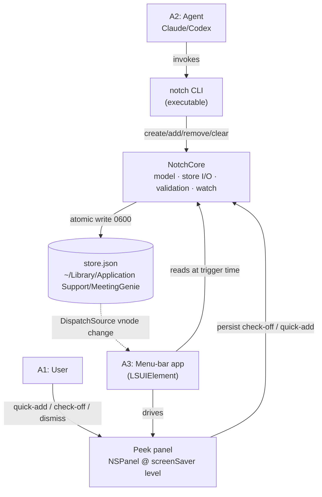
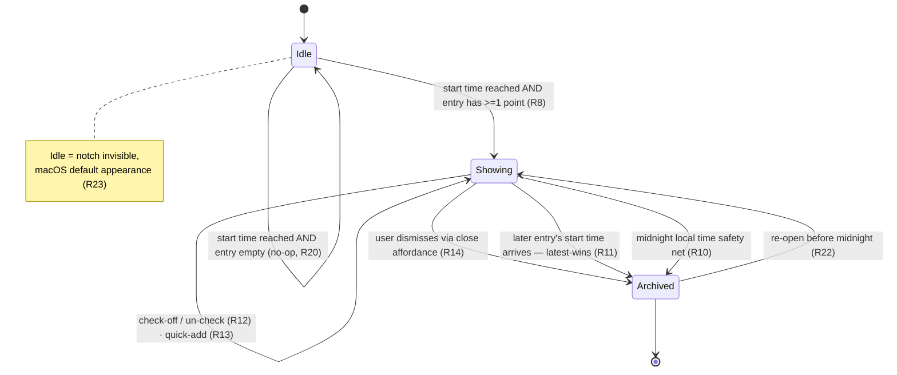

# feat: Notch Meeting Reminders — v1

## Summary

Build a privacy-first native macOS app that surfaces a user's prepared meeting talking points as an ambient "peek" rendered at the notch, above fullscreen video calls. Points are written primarily by AI agents through a local `notch` CLI; the only persisted data is times and note text. v1 ships three products from one repo — a shared `NotchCore` library, the `notch` CLI, and a menu-bar agent app — with no third-party runtime dependencies. A feasibility spike for the notch-over-fullscreen overlay gates the build.

---

## Problem Frame

A prepared talking point is only useful if it's *present and unoccludable* at the moment of the meeting (see origin: `docs/brainstorms/2026-05-29-notch-meeting-reminders-requirements.md`). Paper lives off-screen; a notes app gets buried behind the fullscreen call window. The macOS notch is the one surface the system keeps on top, which is why it's the home for "things to bring up right now."

The hard parts are platform mechanics, not product logic: rendering a window above another app's native-fullscreen Space, detecting notch geometry with a graceful fallback on non-notch displays, and a CLI→app live handoff through a plain local file. The brainstorm settled the product shape; this plan settles how to build it and de-risks the overlay up front.

---

## Key Technical Decisions

- **One repo, three SwiftPM/Xcode products with a pure shared core.** `NotchCore` is an AppKit-free Swift library (model, store I/O, validation, file-watching) so it is unit-testable headlessly and shared by both the CLI and the app. The `notch` CLI and the menu-bar app depend on it. This keeps the agent-facing write path and the GUI honoring exactly one store implementation.
- **Hand-roll the overlay; no third-party runtime dependency.** Research found the only actively-maintained MIT notch library (DynamicNotchKit) supplies *geometry only* and explicitly omits window-level management — every real implementation hand-rolls the panel. We take notch geometry from AppKit (`NSScreen.safeAreaInsets`, `auxiliaryTopLeftArea/Right`) directly, preserving the zero-dependency / zero-setup posture.
- **Non-activating `NSPanel` at `.screenSaverWindow` level for above-fullscreen.** The validated recipe is a borderless `.nonactivatingPanel` at the screen-saver window level with `collectionBehavior = [.canJoinAllSpaces, .fullScreenAuxiliary, .stationary]`. `.fullScreenAuxiliary` is required *together with* `.canJoinAllSpaces` — without it the panel is blocked from a native-fullscreen Space. (see origin: R8, R9)
- **R24 relaxed to best-effort screen-capture exclusion (user decision, 2026-05-29).** macOS 15+ ScreenCaptureKit captures the composited framebuffer, so `NSWindow.sharingType = .none` no longer hides a window from full-display screen-share — and a window floating *above* a fullscreen call is, by construction, in that framebuffer. The user chose visibility over guaranteed privacy: the peek always renders above the call; `sharingType = .none` is still set (it covers "share a window" mode, legacy capture, and macOS ≤14); and the residual leak on full-display macOS 15 share is documented as a user-facing limitation. This refines origin R24 from a guarantee to best-effort.
- **Plain JSON store, owner-only, in Application Support.** The store is a human-readable JSON file the CLI writes and the app reads — agent-writable by design, no opaque format. Written `0600`, atomically (temp-file + rename), under `~/Library/Application Support/MeetingGenie/`. Not encrypted at rest in v1 (documented accepted risk per origin R17); excluded from iCloud; Time Machine exclusion is an open question. (see origin: R1, R2, R3, R17)
- **`DispatchSource` vnode for the live handoff.** The app watches the single store file with a `DispatchSource` file-system-object source (`.write`, `.extend`, `.rename`) — lighter than FSEvents for one file and correctly handles the CLI's atomic-rename writes. v1 also reads at peek-trigger time, so the watch is an enhancement, not a correctness dependency (see origin: R7).
- **Menu-bar agent app (`LSUIElement`), not sandboxed in v1.** The overlay and screen-capture behavior are simplest outside the App Sandbox; the app runs as a background agent with no Dock icon. Sandboxing/notarization/distribution are deferred (see Open Questions).
- **Spike-first sequencing.** U1 is a throwaway prototype that must demonstrate the overlay over a real fullscreen Zoom call before the production surface is built. If it fails, the notch-only positioning is revisited (see origin: Resolve before planning).

---

## High-Level Technical Design

### Component architecture



### Peek lifecycle state machine



Prose is authoritative where it and a diagram disagree.

---

## Output Structure

```text
meetinggenie/
├── Package.swift                      # SwiftPM: NotchCore library + notch executable
├── Sources/
│   ├── NotchCore/                     # AppKit-free shared core (U3)
│   │   ├── Entry.swift                # model: Entry, Point
│   │   ├── Store.swift                # load/save, atomic write, 0600, location
│   │   ├── Validation.swift           # caps + sanitization (R16, R18)
│   │   └── StoreWatcher.swift         # DispatchSource vnode (U5)
│   └── notch/                         # CLI executable (U4)
│       └── main.swift                 # arg parsing → NotchCore calls
├── Tests/
│   └── NotchCoreTests/                # XCTest, headless (U3, U4)
├── app/                               # Xcode project for the menu-bar app
│   ├── MeetingGenie.xcodeproj
│   └── MeetingGenie/
│       ├── Info.plist                 # LSUIElement = YES
│       ├── AppDelegate.swift          # lifecycle, store watch, scheduler (U5, U7)
│       ├── NotchGeometry.swift        # safe-area detection + fallback (U6)
│       ├── PeekPanel.swift            # NSPanel config, window level (U6)
│       └── PeekView.swift             # SwiftUI list, check-off, quick-add (U8)
└── spike/                             # throwaway, deleted after U1
    └── OverlaySpike/
```

The tree is a scope declaration, not a constraint; per-unit `**Files:**` are authoritative.

---

## Requirements Traceability

Origin requirements (R-IDs) mapped to the units that satisfy them. Origin actors A1 (User), A2 (Agent), A3 (Notch app) and flows F1–F4 are honored across U4–U8.

| Origin requirement | Unit(s) |
|---|---|
| R1 entry model; R2 only times/notes; R3 local; R4 no integration | U3 |
| R5 CLI verbs; R6 CLI is sole interface | U4 |
| R7 read at trigger time (live pickup deferred) | U5 |
| R8 peek above fullscreen at start time | U1, U6, U7 |
| R9 non-interrupting, no focus steal | U6 |
| R10 visible until dismiss; midnight safety net | U7 |
| R11 latest-wins + archive | U7 |
| R12 check-off / un-check persists | U8 |
| R13 quick-add; no-op when no peek | U8 |
| R14 dismiss collapses + archives; distinct from check-off | U8 |
| R15 archive retained indefinitely | U3, U7 |
| R16 write-time caps (~7 points / ~80 chars) | U3, U4 |
| R17 store location / perms / backup / encryption posture | U3 |
| R18 untrusted point text validated + sanitized | U3, U4 |
| R19 login-session-only writes, no network path | U4 |
| R20 empty entry is a no-op | U7 |
| R22 re-open dismissed entry before midnight | U7 |
| R23 idle notch invisible | U6, U7 |
| R24 best-effort screen-capture exclusion | U1, U6 |
| R25 quick-add does not steal keyboard focus | U8 |

---

## Implementation Units

### Phase A — Foundations

### U1. Feasibility spike: notch overlay above fullscreen
- **Goal:** Empirically confirm the overlay recipe renders above a real native-fullscreen Zoom/Meet call on the target macOS, and record exactly what `sharingType = .none` does and does not exclude from capture. Gates the rest of the build.
- **Requirements:** R8, R24 (validation); origin "Resolve before planning"
- **Dependencies:** none
- **Files:** `spike/OverlaySpike/` (throwaway — delete after sign-off)
- **Approach:** Minimal app that puts a borderless `.nonactivatingPanel` at `.screenSaverWindow` level with `collectionBehavior = [.canJoinAllSpaces, .fullScreenAuxiliary, .stationary]`, `sharingType = .none`. Manually verify it stays on top when Zoom enters native fullscreen. Then run the capture matrix below. The spike is not shipped; its outcome is a short findings note appended to this plan's Open Questions resolution.
- **Execution note:** Prototype/throwaway — no production tests; the deliverable is the findings, not code.
- **Test scenarios (manual verification matrix):**
  - Panel remains visible above Zoom in native macOS fullscreen (window level correct).
  - Panel remains visible when switching Spaces / when the call app is frontmost.
  - Capture matrix — record visible/hidden for each: Zoom "share entire screen" (full-display SCK), Zoom "share a window", macOS built-in screen recording, QuickTime recording — on macOS 14 and macOS 15.
  - Confirm the documented expectation: visible locally above the call; hidden from window-share/legacy; likely visible in full-display SCK share on macOS 15.
- **Verification:** A written findings note states, per capture path and OS version, whether the peek leaks — and confirms the overlay-above-fullscreen recipe works. If the overlay itself fails, escalate before U6 (notch-only positioning is at risk).

### U2. Project scaffold
- **Goal:** Establish the repo's build structure: SwiftPM package exposing `NotchCore` (library) and `notch` (executable), plus the Xcode app project depending on `NotchCore`.
- **Requirements:** advances all; no behavior of its own
- **Dependencies:** U1 (sign-off that the architecture is worth building)
- **Files:** `Package.swift`, `app/MeetingGenie.xcodeproj`, `app/MeetingGenie/Info.plist` (`LSUIElement = YES`), skeleton source files per Output Structure
- **Approach:** SwiftPM manifest with a library target `NotchCore` and an executable target `notch` depending on it. Xcode app target references the local package. Set `LSUIElement` so the app is a background agent with no Dock icon. No App Sandbox in v1.
- **Test scenarios:** `Test expectation: none -- scaffolding; correctness is "it builds" and is covered by U3/U4 tests compiling against the package.`
- **Verification:** `swift build` produces `NotchCore` and `notch`; the Xcode app target builds and launches as a menu-bar agent with no Dock icon.

### U3. Data model, store, validation (NotchCore)
- **Goal:** Define `Entry { startTime, points[] }` / `Point { text, checked }`, persist to an owner-only JSON file with atomic writes, enforce caps, and treat all point text as untrusted. Archive retained indefinitely.
- **Requirements:** R1, R2, R3, R4, R15, R16, R17, R18; AE5
- **Dependencies:** U2
- **Files:** `Sources/NotchCore/Entry.swift`, `Sources/NotchCore/Store.swift`, `Sources/NotchCore/Validation.swift`, `Tests/NotchCoreTests/StoreTests.swift`, `Tests/NotchCoreTests/ValidationTests.swift`
- **Approach:** Codable model; store file at `~/Library/Application Support/MeetingGenie/store.json`, created `0600`, written temp-file-plus-rename for atomicity. The schema persists only times and point text — no calendar/platform fields exist in the type. Archive is a retained collection of past entries (no purge). Validation enforces ≤~7 points/entry and ≤~80 chars/point, and sanitizes text (strip control characters; treat as data, never interpolated) before persistence.
- **Test scenarios:**
  - `Covers AE5.` Round-trip an entry created with points; inspect the file — it contains only times and point text, no other keys.
  - Atomic write: a write interrupted (simulated) leaves the prior valid file intact, never a partial file.
  - File is created with `0600` permissions; re-opening preserves them.
  - Caps: an 8th point is rejected; an 81-char point is rejected — with a clear error, no partial write.
  - Sanitization: point text containing control characters / newlines is normalized; a point text that looks like JSON is stored and re-read as a literal string, not parsed.
  - Archived entries persist across loads with their checked state intact (no purge).
- **Verification:** `NotchCore` tests pass; manual `cat store.json` shows only times + notes with `0600` perms.

### U4. The `notch` CLI
- **Goal:** Give agents (and the user) the sole v1 write interface: create an entry, add a point, remove a point, clear/remove an entry — writing through `NotchCore`, trusted only within the login session.
- **Requirements:** R5, R6, R16, R18, R19; flow F1
- **Dependencies:** U3
- **Files:** `Sources/notch/main.swift`, `Tests/NotchCoreTests/CLITests.swift`
- **Approach:** Argument parsing maps subcommands (`add <time> <point...>`, `add-point <entry> <text>`, `remove-point`, `clear`/`remove <entry>`) to `NotchCore` calls. No `edit point text` verb (deferred). Writes are local-file only — there is no network or remote write path. Cap/validation failures (R16/R18) surface as non-zero-exit errors with readable messages. The CLI is the sole agent interface; no skill wrapper in v1.
- **Test scenarios:**
  - `Covers F1.` `notch add 2:00pm "raise budget" "ask Q3 timeline"` creates an entry at 2:00pm with two unchecked points readable by `NotchCore`.
  - `add-point` appends to an existing entry; `remove-point` removes one; `clear`/`remove` deletes the entry.
  - Over-cap input (8th point, 81-char text) exits non-zero with a clear message and writes nothing.
  - Malformed time argument exits non-zero without creating an entry.
  - No subcommand performs any network call (verify the interface surface is local-only).
- **Verification:** Each subcommand produces the expected store mutation; error cases exit non-zero and leave the store unchanged.

### Phase B — Surface

### U5. App lifecycle + store watch + scheduler
- **Goal:** The menu-bar agent loads the store, schedules peeks by start time, reads the store at trigger time, and live-refreshes on file changes.
- **Requirements:** R7; supports R8, R10, R11
- **Dependencies:** U3
- **Files:** `app/MeetingGenie/AppDelegate.swift`, `app/MeetingGenie/Scheduler.swift`
- **Approach:** On launch and on store change, read entries via `NotchCore` and (re)arm timers for upcoming start times and the midnight safety net. A `DispatchSource` vnode source on `store.json` (`.write`, `.extend`, `.rename`) triggers a re-read so pre-meeting CLI writes are picked up without restart; correctness does not depend on it since the app also reads at trigger time. Re-arming handles clock changes / sleep-wake.
- **Test scenarios:**
  - An entry written before the app launches is read and scheduled on launch.
  - An entry written by the CLI while the app runs is picked up via the watch and scheduled without restart.
  - An atomic-rename write (temp + rename) is detected (not just in-place writes).
  - After system sleep across a start time, the scheduler re-evaluates and shows/skips correctly on wake.
  - Midnight safety-net timer is armed for any showing entry.
- **Verification:** Timers fire at the right wall-clock moments; CLI writes reflect in the app within a second without restart.

### U6. Peek panel + notch geometry + capture posture
- **Goal:** Build the non-activating overlay panel that renders above fullscreen calls at the notch, with a non-notch fallback, that never steals focus, is invisible when idle, and applies the best-effort capture posture.
- **Requirements:** R8, R9, R23, R24; AE6
- **Dependencies:** U1 (validated recipe), U2
- **Files:** `app/MeetingGenie/PeekPanel.swift`, `app/MeetingGenie/NotchGeometry.swift`
- **Approach:** Borderless `.nonactivatingPanel` at `.screenSaverWindow` level, `collectionBehavior = [.canJoinAllSpaces, .fullScreenAuxiliary, .stationary]`, `becomesKeyOnlyIfNeeded = true`, `sharingType = .none` (best-effort per KTD). Geometry from `NSScreen.safeAreaInsets` + `auxiliaryTopLeftArea/Right`; on a non-notch / external display, fall back to a floating HUD near top-center. Recompute on `NSApplication.didChangeScreenParametersNotification`. When no entry is showing, the panel is ordered out / hidden so the notch shows the macOS default (R23). Document the residual full-display-share leak as a user-facing note.
- **Test scenarios:**
  - `Covers AE6.` When the panel appears while the user is typing in another app, the frontmost app keeps keyboard focus and no alert/sound is emitted (R9).
  - Notch detected on a notch Mac: panel positioned within safe-area geometry.
  - Non-notch / external display: floating-HUD fallback positioned near top-center.
  - Display reconfiguration (plug/unplug external monitor) recomputes placement without crashing.
  - When no entry is showing, the notch region shows the macOS default — no persistent artifact (R23).
  - Manual: panel renders above a fullscreen Zoom call (carrying U1's recipe); `sharingType = .none` set.
- **Verification:** Panel floats over fullscreen calls, never takes focus, hides when idle, and falls back gracefully on non-notch displays.

### U7. Peek lifecycle: trigger, collision, safety net, re-open
- **Goal:** Implement the show/dismiss/collision/midnight/re-open state machine and the empty-entry no-op.
- **Requirements:** R8, R10, R11, R15, R20, R22, R23; AE1, AE2, AE3; flow F4
- **Dependencies:** U5, U6
- **Files:** `app/MeetingGenie/AppDelegate.swift`, `app/MeetingGenie/PeekController.swift`
- **Approach:** On a start-time trigger with ≥1 point, show the entry's peek; an empty entry is a no-op (R20). A showing peek persists until dismissed, with a midnight-local-time auto-dismiss (R10). When a later entry's start time arrives, archive the current entry as-is (checked state retained) and show the new one — latest-wins (R11). A dismissed entry whose start time is past but before midnight can be re-opened from a deliberate notch action, restoring its archived state as the live peek (R22).
- **Test scenarios:**
  - `Covers AE1.` 2:00pm entry with 3 unchecked points → peek shows at 2:00 and is still showing at 2:50 if not dismissed.
  - `Covers AE2.` 2:00pm peek (1 of 3 checked) → at 2:30 a new entry's points show and the 2:00 entry is archived with its 1-of-3 state intact.
  - `Covers AE3.` A never-dismissed peek auto-dismisses and archives at midnight local time.
  - Empty entry at its start time → no peek opens; notch stays collapsed (R20).
  - Re-open: a dismissed 2:00 entry at 2:10 (before midnight) re-opens via the notch action and restores its checked state (R22).
  - Two entries with the same start time → defined, non-crashing behavior (one shows, the other archives) — see Open Questions.
- **Verification:** Each acceptance example reproduces; archived entries always retain checked state; empty entries never open a peek.

### U8. Peek interaction: check-off, dismiss, quick-add
- **Goal:** Render the points list and wire the three on-notch interactions with the focus and gesture constraints.
- **Requirements:** R12, R13, R14, R25; flow F3
- **Dependencies:** U6, U7
- **Files:** `app/MeetingGenie/PeekView.swift`, `Tests/NotchCoreTests/MutationTests.swift` (persistence side)
- **Approach:** SwiftUI list inside the panel. Tapping a point toggles checked/un-checked and persists via `NotchCore` (R12). Dismiss is a dedicated close affordance distinct from the list body so a stray tap can't archive the list (R14). Quick-add reveals an inline field via a deliberate `+` affordance and does not pull keyboard focus from the frontmost app until the user explicitly engages it (R13, R25). A click on the idle notch (no peek showing) is a no-op (R13).
- **Test scenarios:**
  - `Covers AE4.` During a showing peek, clicking the notch's add affordance and typing a line adds a point that appears in the list and persists.
  - Check-off toggles and persists; un-check restores; both survive a re-read of the store (R12).
  - Dismiss via the close affordance archives the entry; tapping a list row only toggles that point, never dismisses (R14).
  - Quick-add does not steal keyboard focus from the frontmost app until the user activates the field (R25); activating then typing works.
  - Clicking the idle notch (no peek showing) does nothing (R13).
- **Verification:** All three interactions behave per the requirements; check-off and quick-add round-trip through the store; dismiss is unambiguous.

---

## Scope Boundaries

### Deferred for later (carried from origin)
- Active nudging (end-of-window pulse for unraised points).
- Programmatic read-back of archives (agent "raised vs. missed" / follow-ups).
- Non-notch Mac fallback as a first-class surface (v1 ships the floating-HUD fallback for positioning but does not invest further).
- A conversational skill wrapper over the CLI.
- Live pickup of writes during an active peek (v1 reads at trigger time; the watch covers pre-meeting writes).
- An `edit point text` CLI verb (remove-and-re-add covers it).

### Outside this product's identity (carried from origin)
- Calendar / Zoom / Meet / Teams or any meeting-platform integration.
- Listening to, transcribing, or note-taking from the call.
- A full GUI for managing entries.
- Cross-device sync, mobile companions, shared/team entries.

### Deferred to Follow-Up Work (plan-local)
- Accessibility (non-color checked-state cues + VoiceOver) — skipped from v1 by user decision in the doc-review; revisit before any public release.
- App Sandbox, code-signing/notarization, and distribution.
- Encryption at rest for the store.

---

## Risks & Dependencies

- **Screen-capture leak on macOS 15 (accepted).** A peek above a fullscreen call will appear in a full-display screen-share on macOS 15+ — no public API prevents it. Accepted per user decision; mitigated only by `sharingType = .none` (window-share/legacy/macOS ≤14) and surfaced as a user-facing limitation. *Mitigation:* document clearly; consider an opt-in "hide while sharing" toggle as future work if users complain.
- **Overlay-above-fullscreen is platform-fragile (U1 gates this).** The recipe is community-validated but undocumented as a guarantee; OS updates could change window-level/Space behavior. *Mitigation:* U1 spike before committing; track `activeSpaceDidChange` for robustness.
- **App-bundle build complexity.** Mixing a SwiftPM core with an Xcode app target needs care (local package reference, signing settings). *Mitigation:* keep `NotchCore` pure and Xcode-agnostic; the app target only links it.
- **Clock/sleep edge cases in scheduling.** Timers across sleep, DST, and clock changes can misfire. *Mitigation:* re-arm on wake and on screen-parameter/clock-change notifications (U5).
- **Dependency:** target macOS version must be decided (drives notch APIs, capture behavior, and the U1 matrix) — see Open Questions.

---

## Open Questions

### Resolved before planning
- **Notch-over-fullscreen + capture exclusion feasibility** → reframed as the U1 spike (gate) plus the R24 best-effort decision. The conflict between "above fullscreen" and "hidden from full-display share" on macOS 15 is accepted; U1 records the empirical capture matrix.

### Deferred to implementation
- Minimum supported macOS version (14 vs 15) and whether to ship a different capture posture per version — finalized from the U1 matrix.
- Time Machine exclusion for the store file (iCloud exclusion is decided; backup exposure otherwise is an accepted risk per origin R17).
- Two entries with the *same* start time: confirm the tie-break (which shows, which archives) — provisional "later-defined-wins, other archives."
- Overlapping / back-to-back meetings vs. latest-wins (carried from origin Outstanding Questions): whether to confirm before replacing a peek that still has unraised points. v1 keeps silent latest-wins (R11).
- The opt-in, no-integration timing source (user-pasted schedule text) vs. fully-manual timing — left to a future iteration; v1 is fully manual.
- Exact CLI subcommand grammar and the re-open gesture/affordance for R22.
- First-run permission prompts (e.g., Accessibility) the overlay may require on the target macOS.

---

## Sources & Research

External research (load-bearing — shaped the overlay KTD, the R24 relaxation, the store-watch choice, and U1's design):

- macOS 15.4 ScreenCaptureKit captures the composited framebuffer; `sharingType = .none` no longer blocks full-display capture — Apple DTS via Tauri issue [#14200](https://github.com/tauri-apps/tauri/issues/14200); Apple Developer Forums [thread 792152](https://developer.apple.com/forums/thread/792152). **Drove the R24 relaxation.**
- Above-fullscreen overlay recipe (non-activating panel, `.screenSaverWindow` level, `canJoinAllSpaces | fullScreenAuxiliary | stationary`) — Apple Developer Forums [thread 26677](https://developer.apple.com/forums/thread/26677); Alin Panaitiu, ["Fullscreen apps above the MacBook notch"](https://notes.alinpanaitiu.com/Fullscreen%20apps%20above%20the%20MacBook%20notch). **Drove U1 / U6.**
- Notch ecosystem: [DynamicNotchKit](https://github.com/MrKai77/DynamicNotchKit) (MIT, geometry only), [boring.notch](https://github.com/TheBoredTeam/boring.notch) (GPL, open fullscreen issues #396/#803) — confirmed hand-rolling the panel is the dominant path. **Drove the zero-dependency KTD.**
- Notch geometry: `NSScreen.safeAreaInsets`, [`auxiliaryTopLeftArea`](https://developer.apple.com/documentation/AppKit/NSScreen/auxiliaryTopLeftArea-uglc). **Drove U6 geometry + fallback.**
- File watching: `DispatchSource` vnode vs FSEvents — [SwiftRocks](https://swiftrocks.com/dispatchsource-detecting-changes-in-files-and-folders-in-swift.html); Alex Chan, ["Watching for file changes on macOS"](https://alexwlchan.net/2026/watch-files-on-macos/). **Drove U5.**
