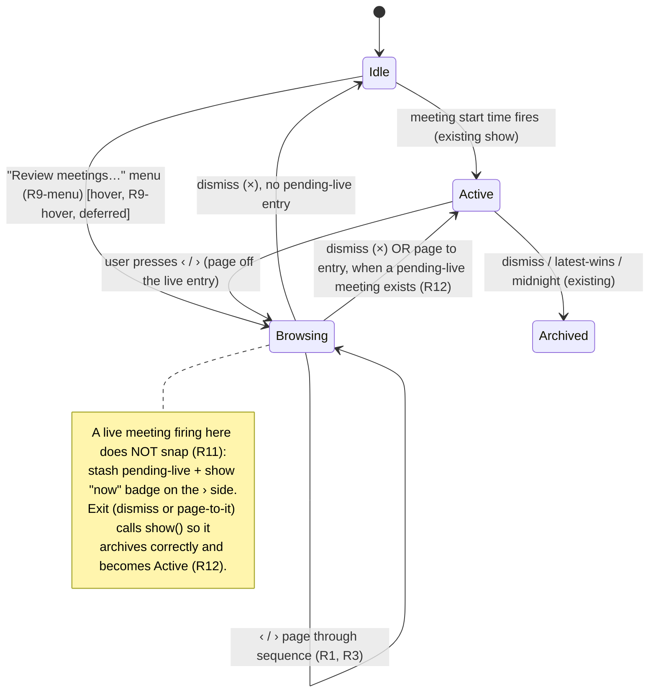

# feat: Meeting Review Navigation

## Summary

Add prev/next **‹ ›** navigation to the notch peek so the user can page through nearby meetings in time order — recent ones (read-only, showing raised vs. missed) and upcoming ones (correctable) — to confirm they covered everything and to verify the AI wrote the right notes before a meeting. Browse is summoned when idle from a new "Review meetings…" menu-bar item (v1); a notch-hover entry point is a deferred follow-up. A live meeting that fires mid-browse never interrupts: it raises a non-interrupting "now" badge instead. Builds on the existing store, archive, and edit paths — no new persistence.

## Problem Frame

Dismissed/expired entries are already retained in `data.archive` (times, points, checked state), and upcoming entries already live in `data.entries`, but there is no way to *see* anything other than the single active peek (see origin: `docs/brainstorms/2026-05-30-meeting-review-navigation-requirements.md`). Two moments go unserved: looking back ("did I raise everything?") and — the sharper one — looking ahead to verify agent-written notes before a meeting. A calendar was considered and rejected: entries are sparse and a grid collides with the product's "glance, not document / no management GUI" identity. Paging the existing peek with arrows delivers both without a new surface.

---

## Key Technical Decisions

- **One assembled sequence, computed on demand from existing data.** A review sequence — recent archived entries, the active entry (if any), and upcoming queued entries, time-ordered — is assembled in `NotchCore` from `data.archive` + `data.entries`. No new stored state; the archive (origin notch-meeting-reminders R15) and active set already hold everything.
- **Recency is derived, not stored.** An item's kind — past / active / upcoming — is computed: archived → past; an active-set entry with `startTime <= now` → active; `startTime > now` → upcoming. This drives the per-recency action gating (R5/R7/R8).
- **Browse is a mode on the existing peek, not a new window.** `PeekController` gains a browse index over the sequence; the same `PeekPanel` / `PeekView` render it. Live "show" (auto-trigger) and "browse" are distinct controller states, tracked separately from `currentEntryID`.
- **A per-point *remove* control is net-new UI.** Today's peek renders only check-off, the × dismiss, and quick-add — there is no per-row remove. Both the upcoming-entry correction path (R5) and the active entry (R8) need a remove affordance, so U3 adds it; it is not a pre-existing control.
- **Entry-by-id remove op is net-new too.** `StoreService` exposes `addPoint(entryID:)` / `setChecked(entryID:)` / `archive(entryID:)` but only `removePoint(at startTime:)`. U1 adds `removePoint(entryID:index:)` mirroring the entry-by-id pattern (load fresh, mutate one field, save) so corrections target one consistent entry (R6).
- **Browse chrome is committed, not left to the implementer.** Arrow layout, the recency indicator, the read-only signal, and the "now" badge are specified in U3/U5 (below) so the minimal glance surface isn't crowded or invented ad hoc.
- **Menu-bar invocation ships in v1; hover is deferred.** The "Review meetings…" menu item (U4a) fully satisfies the invocation need and has no unknowns. The idle-notch hover sensor (U4b) is the plan's only genuinely new machinery and a non-blocking accelerator, so it is a deferred follow-up.
- **Sequence is bounded.** All upcoming queued entries + archived entries within a recent rolling window (default 7 days), so paging back isn't endless. Window is a single tunable constant.
- **Latest-wins suspends during browse.** While browsing, an arriving meeting does not replace/archive the browsed entry (origin R11 override); the controller stashes it as pending-live and raises the "now" badge, surfacing it via `show()` on browse exit so it archives correctly (R11, R12).

---

## High-Level Technical Design

Browse is a state layered over the existing live-peek lifecycle:

Per-recency action gating in the rendered peek:

| Kind | Check-off | Quick-add | Remove point | Visual signal |
|---|---|---|---|---|
| Past (archived) | — (read-only) | — | — | "Past" label + dimmed rows; raised ✓ / missed ○ (R4, R7) |
| Upcoming (queued) | — (not yet happened) | ✓ (R5, R6) | ✓ (R5, R6) | "Upcoming" label |
| Active (now) | ✓ | ✓ | ✓ | "Now" label; full actions (R8) |

Prose is authoritative where it and a diagram disagree.

---

## Requirements Traceability

| Origin requirement | Unit(s) |
|---|---|
| R1 ‹ › page a time-ordered sequence | U1, U2, U3 |
| R2 show time + points + past/now/upcoming indication | U1, U3 |
| R3 graceful ends (arrow disabled at first/last) | U2, U3 |
| R4 archived entries show raised/missed | U1, U3 |
| R5 upcoming correctable (quick-add/remove), not checkable | U1, U3 |
| R6 corrections persist to the shared store | U1, U3 |
| R7 past entries read-only | U3 |
| R8 active meeting keeps full actions (incl. new remove) | U3 |
| R9-menu invocation via menu-bar item | U4a |
| R9-hover invocation via notch hover | U4b (deferred follow-up) |
| R10 hover reveals; idle click stays no-op | U4b (deferred follow-up) |
| R11 latest-wins suspended; "now" badge | U5 |
| R12 surface the live meeting on browse exit | U5 |

Actors A1 (User), A2 (Agent, unchanged), A3 (Notch app); flows F1–F3 honored across U2–U5. Note: with hover deferred (U4b), v1 satisfies R9 via the menu-bar path; R9-hover/R10 ship in the follow-up.

---

## Implementation Units

### Phase A — Data

### U1. Review sequence + entry-by-id remove in NotchCore
- **Goal:** Assemble the time-ordered, bounded sequence of nearby entries with each item's recency kind, and add the entry-by-id remove op the correction path needs.
- **Requirements:** R1, R2, R4, R5, R6
- **Dependencies:** none
- **Files:** `Sources/NotchCore/ReviewSequence.swift` (new), `Sources/NotchCore/StoreService.swift` (add `removePoint(entryID:index:)` + sequence accessor), `Tests/NotchCoreTests/ReviewSequenceTests.swift` (new), `Sources/selfcheck/main.swift` (add checks)
- **Approach:** Introduce a small value type pairing an `Entry` with its kind (`past` / `active` / `upcoming`). Add a `StoreService` method returning the sequence sorted by start time: archived entries within a recent rolling window (default 7 days) as `past`; active-set entries as `active` when `startTime <= now` and `upcoming` when `startTime > now`. Add `removePoint(entryID:index:)` mirroring the existing entry-by-id pattern (load fresh, validate index, remove, save); define lower-bound behavior (removing the last point leaves an empty entry, which `show()` already treats as a no-op/collapse). Both are AppKit-free and headlessly testable.
- **Test scenarios:**
  - `Covers R4.` Archive entry with 2 of 3 points checked → marked `past`, checked state preserved.
  - Upcoming 3pm/4pm + archived 1pm → ordered 1pm(past) → 3pm(upcoming) → 4pm(upcoming).
  - Active-set entry `startTime <= now` → `active`; `startTime > now` → `upcoming`.
  - Archived entries older than the window excluded; entries at the window edge included (boundary).
  - `removePoint(entryID:index:)` removes the targeted point and persists; out-of-range index throws; removing the last point yields an empty entry without error.
  - Empty store → empty sequence (no crash).
- **Verification:** `swift run selfcheck` covers ordering, classification, window bounds, and the new remove op.

### Phase B — Browse on the peek

### U2. Browse state in PeekController + PeekModel
- **Goal:** Add a browse mode — an index over the review sequence with prev/next paging, distinct from live-show — exposing the current item's kind, nav availability, and empty-state to the view.
- **Requirements:** R1, R3
- **Dependencies:** U1
- **Files:** `Sources/MeetingGenieApp/PeekController.swift`, `Sources/MeetingGenieApp/PeekView.swift` (PeekModel fields)
- **Approach:** Add to `PeekModel`: current `kind`, `canPrev`/`canNext`, `nowBadge`, and an `isBrowsing` flag. In `PeekController`, hold the assembled sequence and a browse index (nil = not browsing). `enterBrowse()` builds the sequence, selects the nearest index (active → next-upcoming → most-recent-past), and renders it; if the sequence is empty it shows a minimal "No nearby meetings" state with both arrows disabled rather than opening blank. `pagePrev()`/`pageNext()` move within bounds. **Invariant:** `currentEntryID` tracks the live/active entry; the browse index tracks what's *displayed* while browsing — entering browse from an Active peek does not archive the live entry (it stays in the active set at its `active` slot) and is archived exactly once on its normal dismiss/collision path.
- **Test scenarios:**
  - `Covers R3.` First item → `canPrev` false; last → `canNext` false; paging past an end is a no-op.
  - `enterBrowse()` selects the nearest index per the active→upcoming→past rule.
  - Empty sequence → "No nearby meetings", arrows disabled, no crash.
  - Entering browse from an Active peek leaves the live entry in the active set (not double-archived).
  - Compile-verify; interactive paging verified manually on the notch Mac.
- **Verification:** App builds; paging steps with correct end disabling; empty state renders.

### U3. Navigation UI, per-recency gating, and remove affordance
- **Goal:** Render the ‹ › controls in a committed layout, add a per-point remove affordance, and gate actions + visuals by recency — past read-only (dimmed, raised/missed), upcoming correctable (quick-add + remove, no check-off), active full.
- **Requirements:** R1, R2, R3, R4, R5, R6, R7, R8
- **Dependencies:** U1, U2
- **Files:** `Sources/MeetingGenieApp/PeekView.swift`, `Sources/MeetingGenieApp/PeekController.swift` (gate the mutation callbacks; add remove callback)
- **Approach:**
  - **Layout (committed):** `‹` flush-left of the title row; the title row also carries a small recency label ("Past" / "Now" / "Upcoming") next to the `h:mma` time; `›` and the existing `×` sit at the top-right (× outermost, › inside it) with ≥24pt targets. Quick-add stays at the bottom of the list as today. Arrows are icon-only, styled per the design system (idle-icon opacity, hover bump).
  - **Recency visual (R2):** the label above; past entries additionally render their point rows at reduced opacity so read-only is obvious *before* a tap (R7), distinct from the editable upcoming/active styling.
  - **Remove affordance:** a per-row remove control (revealed on the row for upcoming/active kinds) calling a new `model.onRemove(index)` → controller → `StoreService.removePoint(entryID:index:)`.
  - **Gating:** drive from `model.kind` — `past` rows non-interactive (no toggle/quick-add/remove); `upcoming` quick-add + remove, check-off suppressed; `active` unchanged + remove. The controller no-ops a gated callback even if a stale event arrives.
- **Test scenarios:**
  - `Covers AE1 (R1, R5).` Paging › to an upcoming entry, then removing a point and quick-adding one, persists via the store; no check-off control is offered.
  - `Covers AE2 (R4, R7).` Paging ‹ to an archived 2/3-raised entry shows 2 ✓ / 1 ○, dimmed/read-only, with no edit or check-off controls.
  - `Covers AE5 (R3).` On the earliest item, ‹ is disabled/absent.
  - Active entry retains check-off + quick-add + the new remove.
  - Controller-level: `toggle`/`quickAdd`/`remove` on a `past` item are no-ops.
- **Verification:** App builds; each kind shows the correct controls and recency styling; upcoming corrections (add + remove) round-trip through the store; manual check on the notch Mac confirms the layout isn't crowded.

### U4a. Invocation: menu-bar "Review meetings…"
- **Goal:** Let the user open browse when idle from the existing status-bar menu.
- **Requirements:** R9-menu
- **Dependencies:** U2
- **Files:** `Sources/MeetingGenieApp/AppDelegate.swift`
- **Approach:** Add a "Review meetings…" item to the status-bar menu (alongside "Re-open" / "Quit") that calls `controller.enterBrowse()`. Enabled regardless of active/idle state. No new windows or tracking surfaces.
- **Test scenarios:**
  - `Covers AE3 (R9, menu path).` From idle, choosing "Review meetings…" opens browse at the nearest entry.
  - The item is present and enabled in both active and idle states; rebuilding the menu (on trigger/archive change) preserves it.
- **Verification:** App builds; the menu item opens browse.

### U5. Non-interrupting "now" badge + latest-wins suspension
- **Goal:** While browsing, a meeting reaching its start time must not yank the view — show a "now" badge and surface the live meeting only on browse exit, archiving it correctly.
- **Requirements:** R11, R12
- **Dependencies:** U2
- **Files:** `Sources/MeetingGenieApp/PeekController.swift`, `Sources/MeetingGenieApp/AppDelegate.swift` (route triggers through the controller), `Sources/MeetingGenieApp/PeekView.swift` (badge affordance)
- **Approach:** Route the scheduler's trigger through a single controller entry point that branches on `isBrowsing`: if browsing, stash the entry as pending-live and set `model.nowBadge`; else behave exactly as today (`show`). **Preserve the existing `rebuildMenu()` side-effect on every trigger** (including the stash branch) so the "Re-open"/"Review meetings…" enabled state stays current. **Browse-exit matrix (exhaustive):**
  - dismiss (×) with pending-live → `show(pendingLive)` (archives via the normal path), exit browse → Active.
  - dismiss (×) without pending-live → exit browse → Idle.
  - page to the pending-live entry → clear badge, `show(pendingLive)`, exit browse → Active.
  - page to any other entry while pending-live exists → stay browsing, badge persists.
  - **Badge affordance (committed):** a small static accent dot on the › side (the same green accent used for the active state), no animation; if › is simultaneously disabled (last item), the dot still renders at the right edge.
- **Test scenarios:**
  - `Covers AE4 (R11, R12).` Browsing a past entry when a 2pm meeting fires → view stays put, badge appears; dismissing surfaces the 2pm meeting as active.
  - Paging › to the pending-live entry clears the badge, shows it live, and exits browse.
  - A trigger while NOT browsing shows immediately (no regression).
  - `rebuildMenu()` still fires on a trigger received during browse.
  - Multiple meetings firing during a browse → badge reflects a pending live meeting; latest wins on exit.
- **Verification:** App builds; browse is never interrupted; the live meeting surfaces and archives on exit; menu enablement stays current; non-browse triggering unchanged.

---

## Scope Boundaries

### Deferred for later (carried from origin)
- Agent-facing programmatic archive read-back (a CLI/skill "raised vs. missed" summary). This plan is the user-facing visual half; both read the same archive.
- A jump-to-date / search affordance over a long archive (paging only, for now).

### Outside this product's identity (carried from origin)
- A calendar grid or dense multi-day overview.
- A full management GUI; editing is limited to correcting upcoming entries; past entries are never editable.
- Reading external sources (calendars, platforms) to populate the timeline — the sequence is built only from the local store.

### Deferred to Follow-Up Work (plan-local)
- **U4b — idle-notch hover invocation (R9-hover, R10).** A persistent, non-activating sensor at the notch firing `mouseEntered` → `enterBrowse()`. Input mechanism: `ignoresMouseEvents = false` with an empty `mouseDown` override (true click-through is incompatible with tracking-area `mouseEntered`) **or** a global `mouseMoved` monitor over the notch rect — pick one at implementation. Discoverability: the menu-bar item is the primary path; hover is an accelerator. Mouse-away: dismisses only if the user hasn't paged yet; once paging starts, require ×. Must reuse the non-activating recipe so it never steals focus, and re-pin on screen-parameter changes. Deferred because it's the plan's only real unknown and the menu-bar item fully covers invocation.
- Tuning the sequence-window length and (for U4b) the hover reveal-delay after on-device feel testing.

---

## Risks & Dependencies

- **Browse vs. live-state interleaving.** Browse mode, the scheduler trigger, and latest-wins all mutate what's shown. *Mitigation:* route all triggers through one controller entry point (U5) branching on `isBrowsing`; keep `currentEntryID` vs. browse-index distinct (U2 invariant); the U5 exit matrix is exhaustive and always archives the surfaced live meeting via `show()`.
- **Crowded glance surface.** Adding ‹ ›, a recency label, a remove control, and the badge to a tiny notch peek risks clutter. *Mitigation:* the committed U3 layout and design-system styling; verify on device that the surface stays calm.
- **Hover sensor (now deferred to U4b)** remains the only genuinely new machinery and the main unknown; deferring it keeps it off the v1 critical path, with the menu-bar item as the complete invocation path.
- **Dependency:** builds on the retained archive and the entry-by-id store ops already shipped, plus the one new `removePoint(entryID:)` op (U1); no new persistence or migration.

---

## Open Questions (deferred to implementation)

- Exact recent-window length for the archived side of the sequence (default 7 days) — tune on device.
- Whether the "now" badge also appears when browse was summoned while idle (vs. only when paging from a live peek) — default: it appears whenever a meeting goes live during any browse session.
- Whether to surface the agent-facing read-back at the same time, since it shares the archive data (currently deferred).
