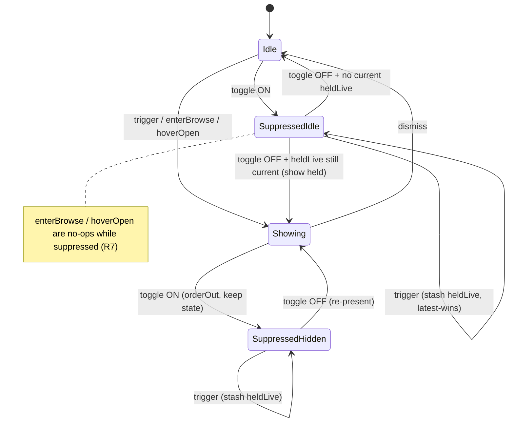

# feat: Peek Presence Layer — Non-Notch Fallback & Hide-While-Sharing

## Summary

Two additions governing *where* the peek appears and *whether* it appears, both anchored to the existing peek surface (`PeekController` + `PeekPanel` + `PeekView`):

1. **Non-notch floating fallback** — when no connected screen has a notch, render the peek as a plain rounded panel centered just **below** the menu bar instead of flush over the top. All peek behavior (browse, check-off, quick-add, inline edit, remove, now-badge, motion) works unchanged.
2. **Hide while sharing** — a manual, session-scoped menu toggle that suppresses the peek (hides what's showing, swallows meeting triggers, blocks browse) and resurfaces the active meeting when flipped back off.

This is a placement/visibility layer over the current single-surface peek, not a new surface. (see origin: `docs/brainstorms/2026-05-30-peek-presence-layer-requirements.md`)

---

## Problem Frame

The peek only renders correctly on a notch display, and it shows regardless of whether the user is presenting:

- **Non-notch unserved.** `NotchGeometry.targetScreen()` already falls back to `NSScreen.main`, but `peekFrame(on:size:)` forces the panel flush to the physical top (`f.maxY - height`) and `PeekPanel.constrainFrameRect` returns the rect unchanged to bypass the menu-bar clamp. On a notch-less Mac that combination renders the panel **over** the menu bar, and `PeekView.peekClip` falls through to the concave `NotchShape` (since `notchWidth == 0`) — a concave-top panel floating over menu-bar items. Worse, `NotchHoverSensor.notchRect()` uses a 220pt fallback width (`detected > 1 ? detected : 220`) centered at top-center, so hover-to-open *also* fires on a non-notch Mac. Table stakes for notch-app competitors; today it's broken.
- **Screen-share leak.** `PeekPanel.sharingType = .none` is documented best-effort (origin R24); full-display ScreenCaptureKit on macOS 15+/26 can still capture the peek. A reliable manual hide closes this without any capture-detection API.

Generic Focus/DND suppression was rejected upstream — the peek isn't ambient, so the only high-leverage suppression trigger is screen-sharing, addressed manually here.

---

## Requirements Trace

Origin requirements (`peek-presence-layer-requirements.md`):

- **R1** (floating below menu bar; plain corners) → U1, U2, U3 — *origin's deferred shape question resolved: plain rounded rectangle, not the concave `NotchShape` (see KTDs).*
- **R2** (notch screen wins when present) → U1, U3
- **R3** (full behavior on the fallback) → U2, U3
- **R4** (re-evaluate on display reconfiguration) → U1, U3
- **R5** (hover notch-only; menu-driven browse on fallback) → U3 — *includes the `NotchHoverSensor` gate so hover does **not** fire on non-notch.*
- **R6, R10** (toggle exists; menu reflects state) → U5
- **R7** (suppress hides + swallows trigger + blocks browse) → U4
- **R8** (resurface active meeting on un-suppress) → U4
- **R9** (session-scoped; off on relaunch) → U4, U5
- **AE1** (floating below menu bar; notch unchanged) → U1, U3 verification
- **AE2** (full behavior + hover-inert + menu-driven browse on fallback) → U3 verification
- **AE3** (toggle hides live + swallows trigger; off resurfaces) → U4 test scenarios
- **AE4** (resets off on relaunch; menu reflects state) → U4, U5

Carried actors: **A1 User**, **A3 Notch app** (chooses surface, honors toggle).

---

## Key Technical Decisions

- **Placement is an explicit model property, not inferred from `notchWidth`.** Add `PeekPlacement { case notch, floating }` to `PeekModel`. `PeekView` selects clip shape and the controller selects frame/inset from this, rather than the current implicit `notchWidth > 0` branch. Inferring placement from `notchWidth` conflates "has a notch" with "render as notch" and has no room for the floating case.
- **Floating pill uses a plain rounded rectangle, radius 20** (all corners), not the concave `NotchShape`. Confirmed during planning — the concave top is designed to hug a physical notch and reads wrong floating below the menu bar. Radius `20` matches the existing peek body radius (`NotchShape(bottomCornerRadius: 20)` in `PeekView.peekClip`); there is no MGTheme radius token today, so the value is named inline consistent with that precedent.
- **Floating pill reuses the existing peek width** (`PeekView.width`, currently `360`). The notch path already sizes the panel at `PeekView.width`; the floating path uses the same width centered on `screenFrame.midX`. No new width constant.
- **Floating top inset is `0`.** In notch mode `topInset` clears the notch band; in floating mode the frame already sits below the menu bar, so `topInset = 0` and the view's existing `.padding(.top, model.topInset + 8)` supplies the 8pt interior chrome padding. The height formula `topInset + rows*26 + 76` then yields a correctly shorter pill. No new padding constant.
- **Floating frame sits below the menu bar via `visibleFrame`.** The floating frame's top edge sits at `visibleFrame.maxY` (just under the menu bar), centered horizontally. No pixel-bleed and no flush-top trick — those exist only to seam the panel into the notch.
- **`constrainFrameRect` returns the frame unchanged in both modes.** In floating mode the frame is already below the menu bar, so returning it unchanged is correct (AppKit won't clamp an already-legal rect). U3's verification confirms this on-device; the contingency, if AppKit unexpectedly clamps, is to gate the override on `model.placement == .notch` and defer to `super` otherwise.
- **Hover-to-open is gated on a notch existing.** Because `NotchHoverSensor` arms a 220pt fallback region on any screen, `PeekController.hoverOpen()` gains a `guard NotchGeometry.anyNotchScreen()` so hover never opens browse on a non-notch Mac (R5/AE2). This is a planned edit, not a contingency.
- **Suppression is in-memory session state on `PeekController`.** A `suppressed: Bool` defaulting to `false`. Because it's never persisted, "resets to off on relaunch" (R9) is automatic. The menu item reflects it via `NSMenuItem.state`.
- **Suppression hides without archiving.** Toggling on calls `orderOut` on the panel but leaves `currentEntryID` / browse state intact, so flipping off can re-present exactly what was hidden. A trigger that fires while suppressed is stashed in a `heldLive: Entry?` slot (latest-wins) and surfaced on un-suppress if still current — never shown mid-share.
- **Suppression indicator is the menu checkmark only (status-bar icon change deferred).** Origin left open whether the status-bar icon should also reflect suppression. Decision: the `NSMenuItem` checkmark (R10) is the v1 indicator; changing the `NSStatusItem` image is deferred (see Scope Boundaries). Rationale: suppression is a deliberate, short-lived action the user takes right before sharing and reverses right after, so the menu checkmark is sufficient; an always-visible status-icon state adds surface for a transient mode.
- **Display reconfiguration re-evaluates placement.** `AppDelegate` already observes `didChangeScreenParametersNotification` → `reload()`. U3 adds `PeekController.handleScreenChange()` **and** wires `reload()` to call it, so a visible peek re-homes on connect/disconnect (R4).

---

## High-Level Technical Design

### Placement selection (U1–U3)

```
configurePanel() / updatePanelFrame():
  screen = targetScreen()                  // notch screen if any, else main
  if anyNotchScreen():                      // a notch exists somewhere
      placement = .notch
      topInset  = notchHeight(screen)
      frame     = peekFrame(...)            // flush top, pixel-snapped, 1pt bleed
  else:
      placement = .floating
      topInset  = 0                         // base .padding(.top, topInset+8) gives 8pt chrome
      frame     = floatingFrame(screenFrame, visibleFrame, size: CGSize(width: PeekView.width, height: h))
                                            // top edge at visibleFrame.maxY, centered
  model.placement = placement
  PeekView picks clip: .notch → NotchTShape/NotchShape ; .floating → RoundedRectangle(cornerRadius: 20)
```

### Suppression state machine (U4)



---

## Implementation Units

### U1. Floating placement detection & frame math in `NotchGeometry`

- **Goal:** Add the "no notch anywhere" predicate and a pure floating-frame computation below the menu bar.
- **Requirements:** R1, R2, R4
- **Dependencies:** none
- **Files:**
  - Modify: `Sources/MeetingGenieApp/NotchGeometry.swift`
- **Approach:**
  - Add `static func anyNotchScreen() -> Bool` → `NSScreen.screens.contains(where: hasNotch)`.
  - Add a **pure** helper `static func floatingFrame(screenFrame: NSRect, visibleFrame: NSRect, size: CGSize) -> NSRect` that centers horizontally on `screenFrame.midX` (`x = screenFrame.midX - size.width/2`) and places the top edge at `visibleFrame.maxY` (`y = visibleFrame.maxY - size.height`). No pixel-bleed. Keeping inputs as `NSRect`/`CGSize` (no `NSScreen`) makes it unit-testable.
  - Add a thin `static func floatingFrame(on screen: NSScreen, size: CGSize) -> NSRect` forwarding `screen.frame`, `screen.visibleFrame`.
  - The caller (U3) passes `size = CGSize(width: PeekView.width, height: <computed>)` — width matches the notch path; no new width constant here.
  - Leave `peekFrame`, `hasNotch`, `notchHeight`, `notchWidth`, `targetScreen` unchanged.
- **Patterns to follow:** mirror the existing static-func style and doc-comment density in `NotchGeometry.swift`.
- **Test scenarios:**
  - Pure `floatingFrame(screenFrame:visibleFrame:size:)`: 1440×900 screen frame, 24pt menu bar (`visibleFrame.maxY = 876`), 360×120 size → `x == midX - 180`, `maxY == 876`, `height == 120` (top edge clears the menu bar, no bleed).
  - No menu-bar inset (`visibleFrame == frame`) → top edge equals `frame.maxY` (degenerate but defined).
  - `Test expectation: pure math is reviewable by inspection; selfcheck imports NotchCore only and cannot reach the app target, so this helper is verified by inspection + on-device AE1 rather than a CLT-runnable test. Do not claim automated coverage.`
- **Verification:** On a non-notch display, the computed frame's top edge sits at `visibleFrame.maxY`, centered.

### U2. `PeekPlacement` model property & floating clip shape in `PeekView`

- **Goal:** Make placement explicit and give the floating case a plain rounded-rect clip.
- **Requirements:** R1, R3
- **Dependencies:** none (parallel-safe with U1)
- **Files:**
  - Modify: `Sources/MeetingGenieApp/PeekView.swift`
- **Approach:**
  - Add `enum PeekPlacement { case notch, floating }` and `@Published var placement: PeekPlacement = .notch` to `PeekModel`.
  - In `peekClip`: `switch placement { case .notch: existing NotchTShape (notchWidth>1) / NotchShape branch unchanged; case .floating: RoundedRectangle(cornerRadius: 20) }`. Radius `20` matches the existing `NotchShape(bottomCornerRadius: 20)` body radius.
  - Floating mode renders the same rows/chrome; only the clip differs. Top padding is unchanged — the controller supplies `topInset = 0` (U3), so the existing `.padding(.top, model.topInset + 8)` yields 8pt interior padding. No view-side conditional on inset.
- **Patterns to follow:** existing `peekClip` computed property (lines 198–208) and `MGTheme` token usage in `PeekView.swift`.
- **Test scenarios:** `Test expectation: none -- pure SwiftUI shape selection; verified on-device via AE1/AE2.`
- **Verification:** With `placement = .floating`, the peek renders with all four corners rounded (radius 20) and no concave top.

### U3. Placement wiring, hover gate, and display re-home in `PeekController`

- **Goal:** Choose notch vs floating frame/inset/placement when configuring/sizing the panel, gate hover so it never fires on a non-notch Mac, and re-home a visible peek on display change.
- **Requirements:** R1, R2, R3, R4, R5
- **Dependencies:** U1, U2
- **Files:**
  - Modify: `Sources/MeetingGenieApp/PeekController.swift`
  - Modify: `Sources/MeetingGenieApp/AppDelegate.swift` (one-line wiring of `handleScreenChange` into `reload()`)
- **Approach:**
  - In `configurePanel()` and `updatePanelFrame()`, branch on `NotchGeometry.anyNotchScreen()`:
    - notch present → `model.placement = .notch`, `topInset = notchHeight(screen)`, frame via `peekFrame`.
    - none → `model.placement = .floating`, `topInset = 0`, frame via `floatingFrame(on: screen, size: CGSize(width: PeekView.width, height: height))` where `height = model.topInset + rows*26 + 76` (i.e. `rows*26 + 76` in floating mode). Set `model.notchWidth = 0` (the floating clip ignores it).
  - **Hover gate (R5/AE2):** in `hoverOpen()`, add `guard NotchGeometry.anyNotchScreen() else { return }` *before* the existing visibility guard, so hover never opens browse on a non-notch Mac. (The `NotchHoverSensor` itself is left as-is; gating in the controller is the single choke point and needs no sensor change.) Confirm on-device that hovering top-center on a non-notch display does nothing.
  - **Display re-home (R4):** add `func handleScreenChange()` — recompute placement; if `panel?.isVisible == true`, call `configurePanel()` + `updatePanelFrame()` to re-home the visible peek; do **not** present a hidden panel. Then wire it: in `AppDelegate.reload()`, after `scheduler?.reload()`, add `controller.handleScreenChange()`. (Without this call site the method is dead — see the coherence finding it resolves.) This closes the origin's open question on notch-disconnect-while-showing: re-home happens immediately on the next screen-parameters notification while the panel is visible.
  - **Idle visibility:** the floating pill follows the same `orderOut`/`presentPanel` lifecycle as the notch peek — it is **not** visible between triggers and not visible when not browsing. There is no persistent empty pill in the idle state.
  - `enterBrowse` via the menu (R5) already works regardless of placement — no notch-specific assumption there.
  - **`constrainFrameRect` verification:** confirm on-device that the below-menu-bar floating frame is not re-clamped to the top (it returns unchanged today). Contingency if it is: gate the `PeekPanel.constrainFrameRect` override on `model.placement == .notch`, returning `super.constrainFrameRect(...)` otherwise. Treat as a contingency, not a planned edit.
- **Patterns to follow:** existing `configurePanel()` / `updatePanelFrame()` (lines ~296–315), `hoverOpen()` (lines 227–230), and `AppDelegate.reload()` (lines 54–57).
- **Test scenarios:** `Test expectation: none -- AppKit/@MainActor lifecycle; verified on-device via AE1 (floating placement) and AE2 (browse/edit/quick-add on the floating pill; hover inert; menu-driven browse).`
- **Verification:**
  - AE1 — on a non-notch Mac, a fired meeting and a "Review meetings…" browse both render the floating pill (radius-20, all corners) below the menu bar, not over it; on a notch Mac rendering is byte-for-byte unchanged.
  - AE2 — browse/check-off/edit/quick-add work on the floating pill; hovering top-center does nothing; the menu item opens browse.
  - Disconnecting/reconnecting a display re-homes a visible peek.

### U4. Suppression state machine in `PeekController`

- **Goal:** Add session-scoped suppression that hides the peek, swallows triggers, blocks browse, and resurfaces the active meeting on un-suppress.
- **Requirements:** R6, R7, R8, R9 (state), AE3, AE4
- **Dependencies:** sequence after U3 (same file — avoid a merge race).
- **Files:**
  - Modify: `Sources/MeetingGenieApp/PeekController.swift`
- **Approach:**
  - Add `private(set) var suppressed = false` and `private var heldLive: Entry?`.
  - `func setSuppressed(_ on: Bool)`:
    - **on:** `suppressed = true`; if `panel?.isVisible == true`, `panel?.orderOut(nil)` (do **not** archive, do **not** clear `currentEntryID`/browse state). Instant hide (no animate-out) is acceptable for a deliberate privacy action.
    - **off:** `suppressed = false`; if a current `heldLive` exists, `show(heldLive)` and clear it; else if a panel with content exists (we hid a live or browse peek), re-present it via `presentPanel()`; else nothing.
  - Gate entry points on `suppressed`:
    - `handleTrigger(entry)`: if `suppressed`, set `heldLive = entry` (latest-wins — a newer trigger replaces the older one) and return (no present, no badge). Otherwise existing behavior.
    - `enterBrowse()` and `hoverOpen()`: if `suppressed`, return immediately (R7 — browse cannot be opened).
  - **"Still current" resurface predicate (R8), concretely:** resurface `heldLive` only if it is still a live candidate at un-suppress time — i.e. it still exists in the active `entries` set (`service.entry(id: heldLive.id) != nil`) **and** its `startTime` is today (`Calendar.current.isDate(_:inSameDayAs: Date())`). Because `handleTrigger` keeps only the newest trigger (latest-wins) and never archives it, a surviving `heldLive` is by construction the most recent meeting; the today-check drops a stale held meeting across a midnight rollover. If the predicate fails, clear `heldLive` and show nothing. (Note: do **not** reuse `reopenLatestArchivedToday`'s predicate verbatim — that one only checks "same day" against the *archive* and would not express the active-set requirement.)
- **Patterns to follow:** existing guard-and-return gating in `toggle`/`removePoint` (`guard model.kind ...`), `service.entry(id:)`, and `show`/`presentPanel`/`archiveCurrent` lifecycle.
- **Test scenarios:**
  - **Covers AE3.** Live peek showing → `setSuppressed(true)` → panel hidden, `currentEntryID` unchanged; `setSuppressed(false)` → same peek re-presented.
  - **Covers AE3.** `setSuppressed(true)` then `handleTrigger(meetingA)` → nothing shown, `heldLive == meetingA`; `setSuppressed(false)` → meetingA shown live.
  - **Covers AE3.** While suppressed, two triggers (A then B) → `heldLive == B` (latest-wins); un-suppress shows B.
  - While suppressed, `enterBrowse()` / `hoverOpen()` → panel stays hidden (no-op).
  - Held meeting no longer in the active set, or `startTime` not today, at un-suppress → dropped, nothing shown.
  - `Execution note: PeekController is @MainActor AppKit-bound and not reachable from the NotchCore selfcheck harness; verify these scenarios on-device. Do not claim automated coverage.`
- **Verification:** Manual AE3 walk-through passes; no peek appears during a share while the toggle is on; the correct meeting returns when it's flipped off.

### U5. "Hide while sharing" menu toggle in `AppDelegate`

- **Goal:** Add the menu item, reflect state, and wire it to `PeekController.setSuppressed`.
- **Requirements:** R6, R10, R9, AE4
- **Dependencies:** U4
- **Files:**
  - Modify: `Sources/MeetingGenieApp/AppDelegate.swift`
- **Approach:**
  - **Menu order** in `rebuildMenu()` (top → bottom): `Re-open last meeting's points` → `Review meetings…` → `Hide while sharing` → separator → `Quit MeetingGenie`. The two peek controls (`Review meetings…`, `Hide while sharing`) sit together above the separator; "Review meetings…" remains the sole browse entry point on a non-notch Mac (R5).
  - Set `item.state = controller.suppressed ? .on : .off` so the checkmark reflects state (R10). `item.target = self`.
  - Add `@objc private func toggleHideWhileSharing()` → `controller.setSuppressed(!controller.suppressed)`, then `rebuildMenu()`.
  - No persistence — the controller's in-memory `suppressed` starts `false` each launch (R9, AE4).
  - **Status-bar icon is unchanged while suppressed** — the menu checkmark is the only indicator in v1 (see KTD rationale; status-icon change deferred). Do not block on this.
  - (The `NotchHoverSensor` non-notch gate lives in U3's `hoverOpen()`; nothing hover-related is needed here.)
- **Patterns to follow:** existing `rebuildMenu()` item construction (lines ~68–98) and the `@objc` action + `target = self` pattern.
- **Test scenarios:** `Test expectation: none -- menu wiring; verified on-device via AE2 (menu-driven browse on fallback) and AE4 (checkmark reflects state, off after relaunch).`
- **Verification:** Menu shows "Hide while sharing" with a checkmark that tracks state; toggling hides/restores the peek; after quit+relaunch it's off.

---

## Scope Boundaries

### Deferred to Follow-Up Work
- A status-bar icon change reflecting active suppression (v1 uses the menu checkmark only).
- Extracting the suppression/held-slot logic into a NotchCore-testable pure type for `selfcheck` coverage (optional hardening; current posture is on-device verification for AppKit-bound code).

### Deferred for later (from origin)
- **Automatic** screen-share / recording detection — the manual toggle is the reliable core.
- A **global hotkey** for "Hide while sharing" — menu item ships first.
- Richer external-display routing for notch-laptop users (showing the peek on an external display while a notch screen is connected).

### Outside this product's identity (from origin)
- Generic Focus/DND suppression.
- Calendar/meeting-platform integration, transcription, full management GUI, sync/mobile/team.

---

## Risks & Dependencies

- **Hover firing on non-notch (resolved here, verify).** `NotchHoverSensor` arms a 220pt fallback region on any screen; U3 gates `hoverOpen()` on `anyNotchScreen()`. Mitigation: AE2 confirms hover is inert on a non-notch display.
- **`constrainFrameRect` interaction (medium).** The override defeats the menu-bar clamp for notch flush-mount; the floating path relies on the below-menu-bar frame being legal and un-clamped. Mitigation: U3 verifies on-device; contingency is the placement-gated override.
- **Resurface correctness (medium).** The "still current" check at un-suppress must not resurface a stale meeting. Mitigation: the concrete predicate in U4 (active-set membership + same-day) plus the stale-drop scenario.
- **Display reconfiguration timing (low).** `didChangeScreenParametersNotification` fans into `reload()`, which (per U3) now calls `handleScreenChange()`. A visible peek mid-transition re-homes on the next event.

---

## System-Wide Impact

- **Actors:** A1 (toggles suppression; sees floating pill on non-notch hardware), A3 (app picks surface, honors toggle). No new actors.
- **Privacy/local-only:** unchanged — no new stored fields, no new permissions; suppression is in-memory.
- **Existing behavior on notch Macs:** must be byte-for-byte unchanged (notch placement path untouched; placement defaults to `.notch`; the hover gate is a no-op when a notch exists).
- **CLI / store / agent surface:** untouched — presentation-layer change only.

---

## Verification Strategy

Automated (CLT `swift run selfcheck`) coverage does not reach the app target; this feature is AppKit/SwiftUI-bound. Verification is:

1. **Build:** `swift build` clean.
2. **Regression:** `swift run selfcheck` still ALL PASS (NotchCore untouched).
3. **On-device acceptance:**
   - AE1 — floating pill (radius-20, all corners) below menu bar on a non-notch display; notch Mac unchanged.
   - AE2 — browse/check-off/edit/quick-add on the floating pill; hover inert on non-notch; menu-driven browse works.
   - AE3 — toggle on hides live + swallows trigger; toggle off resurfaces the active meeting (incl. latest-wins and stale-drop).
   - AE4 — checkmark reflects state; off after relaunch.

Honest gap: the floating-frame placement and the suppression state machine are verified on-device, not by automated test, consistent with the project's established posture for the AppKit-bound peek layer.
