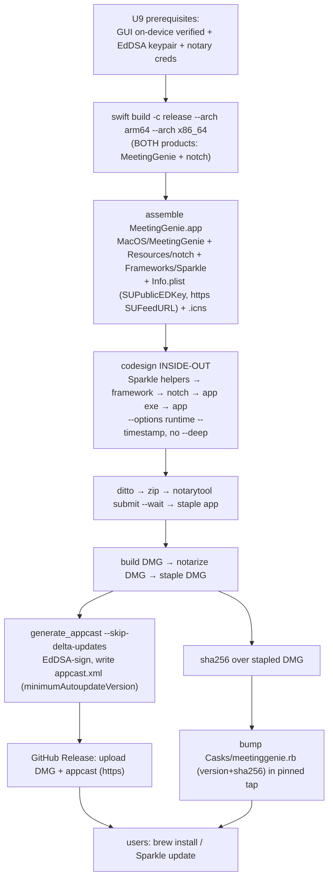
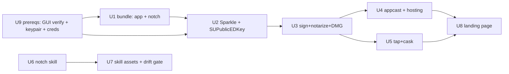

# feat: Ship MeetingGenie — Notarized App, Homebrew Cask, Sparkle, Portable Skill, Landing Page

## Summary

Turn MeetingGenie from a `swift run` project into an installable, self-updating product reachable from any shell-capable agent. Deliverables, phased: (A) a hand-assembled, Developer ID-signed + notarized `.app` — **bundling both the app and the `notch` CLI** — with Sparkle in-app auto-update; (B) distribution via a custom Homebrew cask (own tap) that puts `notch` on `PATH`, fed by a signed-DMG appcast; (C) a portable agent skill the CLI emits (`notch skill`) and that also lives as a static folder; (D) a tracker-free landing page. The privacy-first/local-only identity carries into shipping — the Sparkle update check is the app's only network call, and nothing in the chain adds analytics. (see origin: `docs/brainstorms/2026-06-01-shipping-and-agent-skill-requirements.md`)

---

## Problem Frame

MeetingGenie works but can only be *had* by a developer who clones and runs `swift run`. There's no `.app` bundle, no signing/notarization, no update mechanism, no delivery channel, and no agent-facing skill. This plan builds the distribution + skill layer.

Two hard realities shape it:
- **SwiftPM emits bare Mach-O binaries, never a `.app`, and there is no Xcode here.** Bundle assembly and the inside-out code-signing of Sparkle's nested helpers must be scripted by hand (no "Xcode → Distribute App").
- **`notch` and `MeetingGenie` are two separate SwiftPM executables.** The agent story depends on `notch` riding *inside* the shipped app bundle (so the cask can symlink it to `PATH`); that bundling + signing of the second binary is explicit work, not a side effect of building the app.

---

## Requirements Trace

Origin (`shipping-and-agent-skill-requirements.md`):

- **R1** notarized signed `.app` → U1, U3
- **R2** icon + menu-bar accessory (LSUIElement) → U1
- **R3** `notch` on `PATH`, versioned in lockstep → U1 (build+copy `notch` into bundle), U3 (sign it), U5 (cask `binary` symlink); lockstep is structural (one source tree, one release) — see KTDs
- **R4** `brew install --cask` from a custom tap → U5
- **R5** cask version/sha bump per release → U5, Release Runbook
- **R6** Sparkle background auto-update → U2, U4
- **R7** signed/verified updates, hosted appcast → U2, U4
- **R8** update check is the only network call → U2 (verification)
- **R9** portable skill fetchable before the CLI exists → U7
- **R10** skill bootstrap detects/install `notch` → U7
- **R11** skill documents verbs / model / when-to-use → U6, U7
- **R12** `notch skill` emits the current verb reference → U6
- **R13** works on any shell-capable surface → U7
- **R14** landing page content → U8
- **R15** landing hosts/links appcast + releases → U8, U4
- **R16** no analytics/tracking → U8 (and U2 for the app)
- **R17** repeatable release process → Release Runbook (+ scripts in U3/U4/U5), gated by U9

Actors: **A1 End user**, **A2 Agent**, **A3 Maintainer**.

---

## Key Technical Decisions

- **The bundle ships two signed binaries.** `package-app.sh` builds **both** products universal and places them in the bundle: `MeetingGenie` → `Contents/MacOS/MeetingGenie`, `notch` → `Contents/Resources/notch`. **Both** are code-signed in the inside-out chain (hardened runtime, same Developer ID), or notarization rejects the unsigned nested executable and the cask symlink dangles. This is the load-bearing fix the whole agent story rests on.
- **Hand-assembled `.app` + scripted inside-out signing, not Xcode.** Assemble `Contents/{MacOS,Resources,Frameworks}`, write `Info.plist`, build `.icns` with `iconutil`/`sips`, sign **inside-out** (Sparkle helpers → `Sparkle.framework` → `Contents/Resources/notch` → `Contents/MacOS/MeetingGenie` → `MeetingGenie.app`), each `--options runtime --timestamp`, **never `--deep`**.
- **`@loader_path/../Frameworks` rpath is mandatory** on `MeetingGenieApp` or the bundled app crashes finding Sparkle (works under `swift run`, fails bundled). Verify with `otool -l`. (`notch` has no framework dependency, so it needs no rpath.)
- **Universal binaries** (`--arch arm64 --arch x86_64`) for both products → one cask `sha256`.
- **`notch` ↔ app version lockstep is structural, not a runtime field.** Both binaries are built from one source tree in one release, so they are in lockstep by construction. A `notch --version` verb is *optional* (nice for diagnostics) but not the lockstep mechanism; the runbook bumps a single version for the release.
- **Sparkle 2.x, programmatic, non-sandboxed.** SPM dep (`from: 2.6.0`), `SPUStandardUpdaterController` on the AppDelegate, a "Check for Updates…" menu item, `Info.plist` `SUFeedURL` (**https only** — see below) + `SUPublicEDKey`. Sandbox-only XPC keys/entitlements skipped; framework copied into `Contents/Frameworks` and every nested helper signed with the **same** Developer ID team (Library Validation).
- **EdDSA keypair is generated once, BEFORE the first signed build (U9), not after notarization.** `SUPublicEDKey` must be baked into the shipped `Info.plist`; a build shipped with a placeholder key can never validate any future update. Key custody, backup, and rotation are documented in the runbook (loss = permanently bricked auto-update for the install base). Sparkle supports multiple public keys to enable rotation.
- **Update trust + downgrade protection.** `SUFeedURL` is **https** (macOS ATS blocks http; no `NSAllowsArbitraryLoads`). Each appcast item carries `sparkle:minimumAutoupdateVersion` so a tampered appcast can't push a signed *older* build to current installs. The Sparkle artifact is a signed + notarized **DMG** (stapleable; enables EdDSA key rotation).
- **Signed + notarized DMG; staple order matters.** Notarize the app, staple it, build the DMG, **submit the DMG to notarytool and staple the DMG too**, then compute `sha256` over the final stapled DMG (stapling changes bytes).
- **Minimal entitlements, no sandbox.** The global mouse-move monitor and overlay need **no entitlements**; ship a minimal entitlements file, hardened runtime on, `get-task-allow` absent, no `app-sandbox`.
- **`CFBundleVersion` monotonic** — both notarytool and Sparkle depend on a strictly increasing build number; the runbook owns the bump.
- **Cask uses `app` + `binary` symlink, `auto_updates true`, pinned tap.** `binary "#{appdir}/MeetingGenie.app/Contents/Resources/notch"`. The bootstrap and cask reference the **exact, fully-qualified tap** (pinned before publishing the skill; the tap repo must never be renamed/transferred — a generic placeholder is a tap-spoofing RCE vector). `livecheck` and a rich `zap` are core-tap conventions and are **deferred** (the tap submission is deferred); v1 ships a minimal cask.
- **Skill ships twice from one source, with a drift gate.** `notch skill` emits a frontmatter'd `SKILL.md` (versioned with the binary). The static `skill/` folder carries the same content (fetchable before `notch` exists, to instruct the install). A **selfcheck/CI assertion** fails the build if the committed static skill's verb set diverges from `notch skill` output — drift is a hard gate, not a manual runbook hope. `notch skill` is **prints-only** in v1 (`--install` deferred).

---

## High-Level Technical Design

### Release pipeline (A3; U1–U5, gated by U9)

### Unit dependencies

(U6/U7 are independent of the signing chain. U9 gates the whole pipeline.)

---

## Implementation Units

### U9. Prerequisites — GUI verification, EdDSA keypair, signing credentials (do first)

- **Goal:** Establish the hard prerequisites the rest of the pipeline silently assumes, so they can't be skipped under delivery pressure.
- **Requirements:** gates R1, R6, R7, R17
- **Dependencies:** none
- **Files:** Create: `docs/RELEASING.md` (prerequisites + credential/key sections)
- **Approach:**
  - **GUI on-device verification gate:** the running app must be confirmed on-device (peek renders during a real call; quick-add focus/clicks work) **before** any signing. Per `README.md` the GUI runtime is currently unverified; shipping a notarized, auto-updating build of a broken GUI is worse than not shipping. Record explicit pass criteria.
  - **EdDSA keypair (one-time):** `generate_keys` → record `SUPublicEDKey` (consumed by U2); store the private key in Keychain AND back it up to a durable secret store (the loss-of-key scenario permanently strands the install base). Export via `generate_keys -x` only into a protected secret, never committed.
  - **Notary credentials (one-time):** `notarytool store-credentials` creates a keychain profile; document that the app-specific password is entered once here and **never** appears as a script argument, env var, or log. Use a dedicated Apple ID for notarization where possible.
- **Patterns to follow:** Sparkle EdDSA docs; Apple notarytool `store-credentials` (Sources & Research).
- **Test scenarios:** `Test expectation: none — a gate/checklist unit. Verified by: the GUI pass-criteria checklist is signed off, `SUPublicEDKey` exists, and `notarytool` profile resolves, before U3 runs.`
- **Verification:** A documented, checked-off prerequisites section exists; the keypair and notary profile are in place; the GUI is confirmed working on-device.

### U1. Assemble a distributable `.app` bundle (app + `notch`)

- **Goal:** Produce `MeetingGenie.app` (unsigned, runnable) containing **both** binaries.
- **Requirements:** R1, R2, R3
- **Dependencies:** U9
- **Files:** Create: `scripts/package-app.sh`, `packaging/Info.plist`, `packaging/AppIcon.iconset/` → `AppIcon.icns`. Modify: `Package.swift` (rpath linker flag on `MeetingGenieApp`)
- **Approach:**
  - Add `-rpath @loader_path/../Frameworks` to `MeetingGenieApp`; verify with `otool -l`.
  - `package-app.sh`: universal `swift build -c release --arch arm64 --arch x86_64` (builds all products); copy `MeetingGenie` → `Contents/MacOS/MeetingGenie` (name = `CFBundleExecutable`) **and `notch` → `Contents/Resources/notch`** (confirm both are universal via `lipo -info`); render `Info.plist` (`CFBundleIdentifier` e.g. `app.meetinggenie`, `CFBundleVersion`/`ShortVersionString`, `LSUIElement=true`, `LSMinimumSystemVersion=13.0`, `CFBundleIconFile`); build `.icns` via `iconutil`; `xattr -cr`.
- **Patterns to follow:** scriptingosx "notarized SwiftPM executable"; `Package.swift` products (`MeetingGenie`, `notch`).
- **Test scenarios:** `Test expectation: none — verified by launching the .app (menu-bar only, peek renders) and confirming `Contents/Resources/notch` exists and runs (`./MeetingGenie.app/Contents/Resources/notch list`).`
- **Verification:** Double-click launches the menu-bar app; `otool -l` shows the rpath; `notch` runs from inside the bundle.

### U2. Integrate Sparkle (programmatic, embedded, signed)

- **Goal:** In-app background auto-update wired and embedded.
- **Requirements:** R6, R7, R8
- **Dependencies:** U9 (SUPublicEDKey), U1
- **Files:** Modify: `Package.swift` (Sparkle dep), `Sources/MeetingGenieApp/AppDelegate.swift` (updater + menu item), `packaging/Info.plist` (`SUFeedURL` https, `SUPublicEDKey`), `scripts/package-app.sh` (embed `Sparkle.framework`)
- **Approach:** Add `Sparkle` (`from: 2.6.0`); hold `SPUStandardUpdaterController(startingUpdater: true, …)` on the AppDelegate; "Check for Updates…" menu item. Copy `Sparkle.framework` into `Contents/Frameworks` preserving the `Versions/Current` symlink. Set `SUPublicEDKey` (from U9) and an **https** `SUFeedURL`. Confirm no extra egress (R8).
- **Patterns to follow:** Sparkle "Programmatic setup"; existing `AppDelegate.rebuildMenu`.
- **Test scenarios:** `Test expectation: none — on-device: app launches with Sparkle loaded (no dyld crash → confirms U1 rpath), menu item present, manual check contacts the test appcast. Cross-version update exercised in U4.`
- **Verification:** App launches Sparkle-loaded; "Check for Updates…" reaches the https appcast.

### U3. Sign, notarize, staple, and build the DMG

- **Goal:** A repeatable script producing a Gatekeeper-clean, notarized, stapled DMG.
- **Requirements:** R1, R3, R5
- **Dependencies:** U2
- **Files:** Create: `scripts/sign-and-notarize.sh`, `packaging/entitlements.plist` (minimal), `scripts/make-dmg.sh`
- **Approach:**
  - **Inside-out** `codesign`: Sparkle's `Autoupdate`, `Updater.app` + inner exe, `XPCServices/*` (if kept) → `Sparkle.framework` → **`Contents/Resources/notch`** → `Contents/MacOS/MeetingGenie` (with `entitlements.plist`) → `MeetingGenie.app`. Each `--force --options runtime --timestamp --sign "Developer ID Application: …"`. No `--deep`.
  - Pre-flight: abort with a clear error if the notary keychain profile is absent (never fall back to inline `--apple-id/--password`).
  - `ditto -c -k --keepParent` → zip → `notarytool submit --keychain-profile … --wait` → `stapler staple` the app → `make-dmg.sh` builds the DMG → **notarize + staple the DMG** → `shasum -a 256` the final DMG.
  - Verify: `codesign --verify --strict` (incl. `notch`), `spctl -a -vvv -t exec`, `stapler validate`.
- **Patterns to follow:** Apple TN2206; "Code Signing and the Sparkle Framework" (Sources & Research).
- **Test scenarios:** `Test expectation: none — verification is tool output: notarytool Accepted (app and DMG), stapler validate passes, spctl accepts, codesign --verify --strict passes for the app AND notch.`
- **Verification:** On a clean Mac the DMG opens, the app launches with no Gatekeeper warning, and `notch` inside it is signed.

### U4. EdDSA appcast generation + hosting

- **Goal:** A signed, downgrade-resistant appcast Sparkle consumes, hosted over https.
- **Requirements:** R6, R7, R15
- **Dependencies:** U3 (keypair itself is created in U9)
- **Files:** Create: `scripts/update-appcast.sh`; extend `docs/RELEASING.md`
- **Approach:** `update-appcast.sh` runs `generate_appcast --skip-delta-updates <dir-of-DMGs>` (full-download appcast for v1 — deltas need ≥2 releases and are deferred); ensure each item has `sparkle:minimumAutoupdateVersion` to block downgrade pushes. Host `appcast.xml` + DMGs on GitHub Releases (immutable versioned assets, **https**); the landing page links/serves the same feed (R15). Private key comes from U9's Keychain/secret.
- **Patterns to follow:** Sparkle "Publishing an update"; EdDSA docs (Sources & Research).
- **Test scenarios:** `Test expectation: none — covers AE3: install N, publish N+1, confirm one-click EdDSA-verified update; tampering the DMG → Sparkle rejects; a crafted older-version appcast entry is NOT offered to a current install (minimumAutoupdateVersion).`
- **Verification:** A version-N app updates to N+1 in one click; tamper and downgrade attempts are rejected.

### U5. Homebrew tap + cask

- **Goal:** `brew install --cask` installs the app and puts `notch` on `PATH`.
- **Requirements:** R3, R4, R5
- **Dependencies:** U3
- **Files:** **Target repo: a separate `homebrew-tap` repo (created during execution).** Create: `Casks/meetinggenie.rb`. Modify (this repo): `docs/RELEASING.md` (cask-bump step), `README.md` (install instructions)
- **Approach:** Minimal v1 cask: `version`, single `sha256` (universal DMG), `url` → GitHub Release asset (`verified:`), `app "MeetingGenie.app"`, `binary "#{appdir}/MeetingGenie.app/Contents/Resources/notch"`, `auto_updates true`, `depends_on macos: ">= :ventura"`. **No `livecheck`; minimal/omitted `zap`** (both are core-tap conventions, deferred with the core submission). The exact tap is pinned and documented; the runbook bumps `version`+`sha256` each release (Homebrew 5.2 greedy default reinstalls a stale cask over Sparkle).
- **Patterns to follow:** Homebrew Cask Cookbook; VS Code cask (`app`+`binary`) (Sources & Research).
- **Test scenarios:** `Test expectation: none — covers AE1: on a clean Mac, brew tap + install yields a Gatekeeper-clean app and a working `notch` on PATH (`which notch` resolves into the Homebrew bin dir); a Sparkle in-place update preserves Contents/Resources/notch so the symlink doesn't dangle.`
- **Verification:** Clean-machine `brew install --cask` works; `notch` resolves; post-Sparkle-update the symlink still points at a real binary.

### U6. `notch skill` subcommand

- **Goal:** The CLI emits a complete frontmatter'd `SKILL.md` so the agent doc never drifts from the binary.
- **Requirements:** R11, R12
- **Dependencies:** none
- **Files:** Modify: `Sources/notch/main.swift` (new `skill` verb), `Sources/selfcheck/main.swift`. Create: `Sources/NotchCore/SkillDoc.swift` (single source for the doc text + verb table, shared by the CLI and the drift assertion)
- **Approach:** `notch skill` prints a SKILL.md with YAML frontmatter (`name: notch`, trigger-rich `description`), the detect-and-install bootstrap, and the verb reference (verbs, time formats, times+notes+title-only model). The verb list is sourced from the same definition the CLI dispatches on (in `SkillDoc.swift`) so it cannot drift. **v1 is prints-only — `--install` is deferred.** Update `usage` to list `skill`.
- **Patterns to follow:** existing `switch command` arms; shell-completion-generator prior art.
- **Test scenarios:**
  - **Covers R12.** `notch skill` output has valid frontmatter (`name:`, `description:`) and lists **every** verb the CLI supports (assert each token).
  - The emitted bootstrap guards with `command -v notch` before `brew install`, and references the **pinned** tap.
  - `Execution note: this is the one shipping unit with CLT-runnable coverage — assert the emitted doc in selfcheck.`
- **Verification:** `swift run notch skill` prints a well-formed SKILL.md; selfcheck asserts frontmatter + verb completeness.

### U7. Portable static skill assets + drift gate

- **Goal:** A fetchable skill usable on any shell surface (incl. before `notch` exists), provably in sync with the binary.
- **Requirements:** R9, R10, R11, R13
- **Dependencies:** U6
- **Files:** Create: `skill/SKILL.md`, `skill/scripts/bootstrap.sh`, `skill/references/notch-cli.md`. Modify: `Sources/selfcheck/main.swift` (drift assertion)
- **Approach:**
  - `SKILL.md`: frontmatter (name, trigger-rich description); lean body (<500 lines) with bootstrap + compact verb table; detail in `references/notch-cli.md`.
  - `bootstrap.sh`: idempotent, non-interactive — `command -v notch >/dev/null 2>&1 || brew install --cask <PINNED-tap>/meetinggenie`. The tap is the **exact, fully-qualified** name (no placeholder) — pinned before the skill is published; documented as must-never-rename.
  - **Drift gate:** a `selfcheck` assertion fails if the committed `skill/SKILL.md` verb set diverges from `notch skill` output, so the pre-install static copy can't silently document stale verbs.
  - Fetchable by raw URL from this repo (R9).
- **Patterns to follow:** `skill-creator` SKILL.md conventions (frontmatter-as-trigger, progressive disclosure, deterministic `scripts/`); vendored `docs/design-system/SKILL.md` as a shape example.
- **Test scenarios:**
  - **Covers AE2.** `bootstrap.sh` without `notch` runs the documented `brew install`; with `notch` it's a no-op.
  - Drift assertion fails when `skill/SKILL.md` verbs ≠ `notch skill` verbs.
  - Frontmatter `description` states what + when (discoverable).
- **Verification:** An agent on a clean shell surface, given only the skill, installs `notch` and writes a point; the drift assertion is green.

### U8. Landing page

- **Goal:** A tracker-free page: what it is, install, the skill, demo, and appcast/release links.
- **Requirements:** R14, R15, R16
- **Dependencies:** U4, U5
- **Files:** Create: `docs/landing/` (static `index.html` + assets) or `gh-pages`
- **Approach:** Content: what it is, the one-line `brew install` (pinned tap), the skill (link + `notch skill`), a peek demo (captured after U9's GUI verification), download/appcast links over **https**. **No analytics/tracking/third-party beacons** (R16). Host on GitHub Pages (https).
- **Patterns to follow:** `docs/design-system/` tokens.
- **Test scenarios:** `Test expectation: none — covers AE5: install command works as written, links resolve over https, network panel shows zero tracking/analytics requests.`
- **Verification:** Page loads over https, install command succeeds, no tracking requests fire.

---

## Scope Boundaries

### Deferred to Follow-Up Work
- Submitting the cask to **homebrew-cask core** (start with the custom tap) — and the core conventions it pulls in (`livecheck`, full `zap`).
- A secondary **notarized DMG download for users who don't use Homebrew**.
- **Sparkle delta updates** (need ≥2 releases; `--skip-delta-updates` in v1).
- **CI release automation** (GitHub Actions notarization + appcast + cask bump) — v1 is a manual runbook + scripts.
- `notch skill --install <path>` (v1 prints only).
- Thin per-surface skill wrappers (Claude Code plugin entry, Codex `AGENTS.md` pointer).

### Outside this product's identity
- **Mac App Store** distribution (sandbox vs the global monitor/overlay; can't expose `notch`).
- **Per-surface native integrations** as the primary strategy.
- **Analytics, telemetry, accounts, or integrations** on the app or landing page.

---

## Risks & Dependencies

- **Apple Developer ID ($99/yr) — hard prerequisite** (assumed; established in U9). Gates the entire signed chain; nothing degrades gracefully to an unsigned build.
- **`notch` not in the bundle (was the top defect; now U1/U3).** If `notch` isn't built+copied+signed into the bundle, the cask symlink dangles and the agent story fails. Mitigation: explicit U1 copy + U3 signing + U1/U5 verification.
- **EdDSA private-key loss or compromise (high).** Loss permanently strands the install base (no key can sign an acceptable update); compromise lets an attacker sign malicious updates. Mitigation: U9 backup/custody; runbook rotation procedure (ship a transitional build carrying old+new `SUPublicEDKey`, then a new-key-only release); dedicated secret store.
- **Inside-out signing of Sparkle helpers + `notch` (high).** A mis-signed/`--deep`'d/wrong-team component fails Library Validation. Mitigation: explicit per-component signing + `codesign --verify --strict` gate.
- **First-release key/ordering circularity (resolved).** Keypair generation is U9, before U2 bakes `SUPublicEDKey` — not after notarization.
- **Appcast/feed tampering + downgrade (medium).** Mitigation: https `SUFeedURL` (ATS, no arbitrary loads), `minimumAutoupdateVersion` per item, EdDSA over a Developer-ID DMG.
- **Tap repo is a trust root (medium).** Homebrew evaluates the cask Ruby at install time; a compromised/renamed tap = RCE on installs. Mitigation: pin the exact tap in the bootstrap + cask, protect the tap repo (branch protection), never rename/transfer.
- **notarytool credential exposure (medium).** Mitigation: keychain-profile only, never inline password/env, dedicated Apple ID, pre-flight abort if profile missing.
- **rpath omission / `CFBundleVersion` non-monotonicity / cask-version drift (medium each).** Mitigations: `otool -l` check; runbook version bump; cask `version`/`sha256` bumped every release.
- **GUI not yet on-device-verified (medium → gated).** Now an explicit U9 prerequisite that blocks the pipeline.

---

## Documentation / Operational Notes — Release Runbook (R17)

`docs/RELEASING.md` documents the end-to-end manual process and its prerequisites:
- **Prerequisites (U9):** GUI on-device sign-off checklist; EdDSA keypair generation + backup/custody; notarytool `store-credentials` setup (no inline passwords).
- **Per release:** bump `CFBundleVersion` → `package-app.sh` (app + `notch`, universal) → `sign-and-notarize.sh` (inside-out incl. `notch`) → `make-dmg.sh` + notarize/staple DMG → `update-appcast.sh` (`--skip-delta-updates`, `minimumAutoupdateVersion`) → upload DMG + `appcast.xml` (https) to a GitHub Release → bump `Casks/meetinggenie.rb` in the pinned tap → confirm the static skill drift assertion is green.
- **Key rotation procedure** (for loss/compromise): documented transitional multi-key release.

---

## System-Wide Impact

- **Actors:** A1 (install + updates), A2 (skill-driven CLI), A3 (release pipeline). No change to the app's runtime behavior or data model beyond one new CLI verb (`notch skill`) and the `SkillDoc` source.
- **Privacy/local-only:** preserved and explicit — minimal entitlements, no sandbox data changes, the Sparkle https appcast fetch is the app's only network call, no analytics anywhere.
- **Repos:** this repo (app, CLI, scripts, skill, landing source) **plus** a new pinned `homebrew-tap` repo.

---

## Verification Strategy

Mostly tool-output + on-device, plus the new automated drift gate:

1. **Build:** `swift build` clean; `swift run selfcheck` ALL PASS (NotchCore + `notch skill` frontmatter/verb assertions + the static-skill drift assertion).
2. **Signing/notarization:** `codesign --verify --strict` (app **and** `notch`), `spctl`, `notarytool Accepted` (app + DMG), `stapler validate`.
3. **Clean-machine acceptance (the real bar):**
   - AE1 — `brew install --cask <pinned-tap>/meetinggenie` installs Gatekeeper-clean; `notch` on `PATH`.
   - AE2 — an agent on a shell surface, given only the skill, bootstraps `notch` and writes a point.
   - AE3 — a running app auto-updates from the https appcast in one click (EdDSA-verified); tamper + downgrade rejected.
   - AE4 — `notch skill` emits a verb reference matching the installed binary; the committed static skill matches it (drift gate).
   - AE5 — app makes only the Sparkle call; landing page sets no trackers.
4. **Prereq gate:** U9 checklist (GUI verified, keypair + notary profile present) is signed off before any signing.

Honest gap: only `notch skill` + the drift assertion have CLT-runnable coverage; signing, notarization, Sparkle updates, the cask, and the landing page are verified by tool output and on-device runs — and the whole pipeline is gated on U9's GUI verification.

---

## Sources & Research

- SwiftPM-executable → notarized bundle (no Xcode): scriptingosx; rsms code-signing gist; Dimillian SPM app-packaging.
- Apple: TN2206, `notarytool`, `addGlobalMonitorForEvents` (mouse-move needs no entitlement).
- Sparkle: documentation, programmatic setup, publishing, sandboxing, EdDSA migration (multi-key rotation); "Code Signing and the Sparkle Framework" (inside-out helper signing).
- Homebrew: Cask Cookbook, How to Create and Maintain a Tap, Brew-Livecheck, FAQ; `auto_updates`/greedy-default (homebrew/brew #21951, homebrew-cask #170994); VS Code cask (`app`+`binary`).
- Skill conventions: local `skill-creator` SKILL.md; shell-completion generators as "CLI emits its own integration artifact" prior art.
